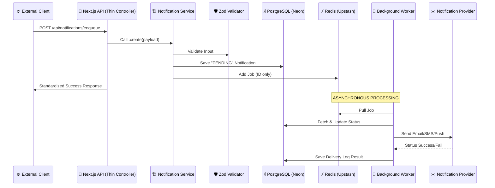

# NotifyFlow: Comprehensive Project Guide

Welcome to your first Next.js application! **NotifyFlow** is a professional-grade notification engine. It’s built to be **asynchronous**, which means it handles heavy tasks (like sending emails or SMS) in the background so your app stays fast for users.

---

## 🏗️ 1. The Big Picture (Architecture)

We use a **Modern Service Architecture**. This pattern keeps your business logic separated from your infrastructure (DB/Queue).

### The Flow of Data
Here is a visualization of what happens when someone sends a notification request:

---

## 📂 2. Directory & File Breakdown

### `/src/app/api` (Thin Controllers)
These routes act as simple endpoints that delegate logic to the Service layer.
- `api/notifications/enqueue/route.ts`: Entry point for sending notifications.
- `api/notifications/[id]/logs/route.ts`: Audit log retrieval.

### `/src/application/services` (The Brains)
- `notification-service.ts`: The primary orchestrator. Uses methods like `create()`, `findAll()`, and `getLogs()`.

### `/src/shared/validators` (The Gatekeepers)
- `notification-validator.ts`: Centralized Zod schemas shared across the whole project.

### `/src/infrastructure/database` (Data Access)
We use a **Granular Repository Pattern**:
- `notification-repository.ts`: Handles notification records (`findById`, `upsert`, `updateStatus`).
- `log-repository.ts`: Handles delivery history (`create`, `findByNotificationId`).

### `/src/infrastructure/providers` (The Hands)
- `factory.ts`: Uses the **Strategy Pattern** to dynamically pick the right provider (Email, SMS, or Push).

---

## 🚦 3. Why This Design?

1.  **Maintenance**: Want to change how logs are stored? Edit `log-repository.ts`. Nothing else breaks.
2.  **Scalability**: Adding a new provider (like WhatsApp) only requires one new file in `/providers`.
3.  **Simplicity**: Method names are short and intuitive (`findById`, `create`).

---

## 📋 4. How to Run Locally

1.  **Install**: `npm install`
2.  **Web Server**: `npm run dev`
3.  **Worker Process**: `npm run worker:start`

Now, when you hit the API in one terminal, you will see the logs appearing in the other terminal where the worker is running!
