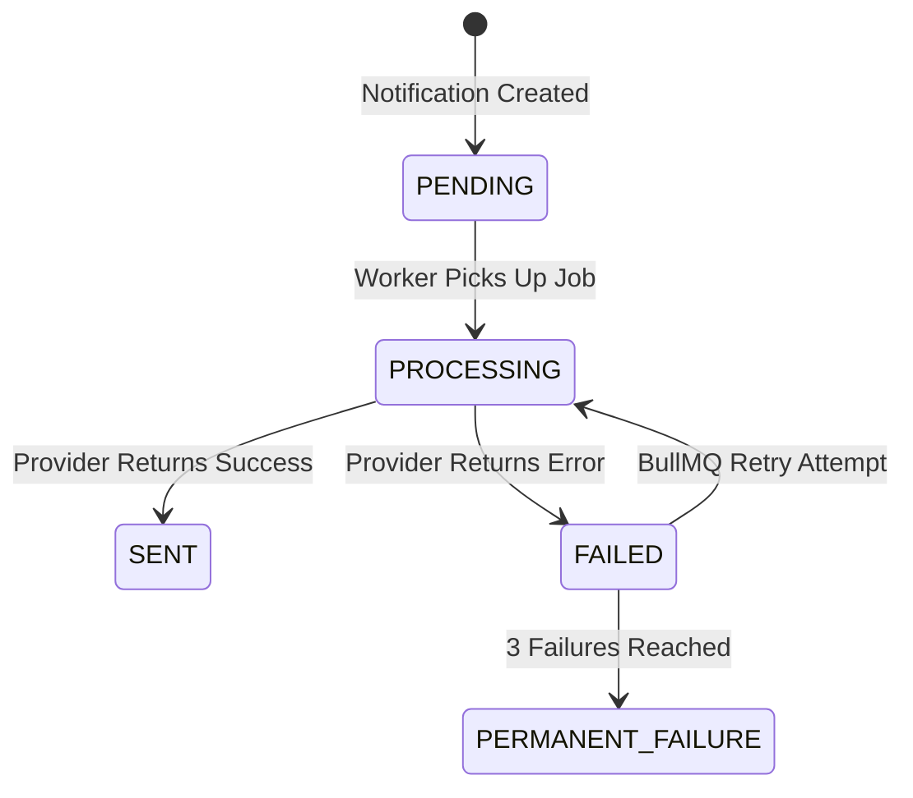

# Data Model: Notification Worker Processor

This document outlines the data structures and relationships used by the asynchronous notification system.

## Entities

### `Notification` (Main Entity)

The core object representing a message intent.

| Field            | Type        | Description                                                  |
| :--------------- | :---------- | :----------------------------------------------------------- |
| `id`             | `UUID`      | Unique identifier.                                           |
| `type`           | `ENUM`      | `EMAIL`, `SMS`, `PUSH`.                                      |
| `recipient`      | `String`    | Target identifier (email address, phone number, push token). |
| `payload`        | `JsonB`     | Channel-specific data (subject, body, template IDs).         |
| `status`         | `ENUM`      | `PENDING`, `PROCESSING`, `SENT`, `FAILED`.                   |
| `attempts`       | `Int`       | Counter of delivery starts.                                  |
| `idempotencyKey` | `String?`   | Unique reference from the source system.                     |
| `lastAttemptAt`  | `DateTime?` | Timestamp of the most recent pick-up.                        |

### `NotificationLog` (Audit Entity)

History of individual delivery attempts.

| Field            | Type    | Description                                   |
| :--------------- | :------ | :-------------------------------------------- |
| `id`             | `UUID`  | Log entry ID.                                 |
| `notificationId` | `UUID`  | Back-reference to the parent notification.    |
| `status`         | `ENUM`  | Outcome of the specific attempt.              |
| `errorMessage`   | `Text?` | Raw error details from the provider (if any). |
| `metadata`       | `JsonB` | Raw provider response payload.                |

## State Transitions

